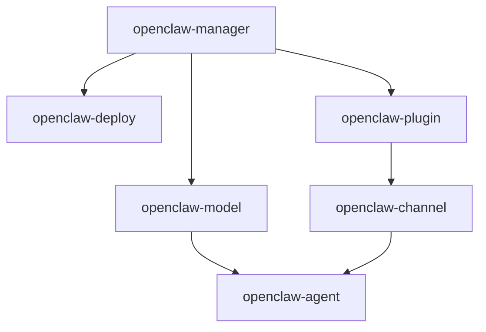

# OpenClaw 技能包集合

本目录包含所有 OpenClaw 管理相关的 Cursor 技能包。

## 📦 技能包列表

| # | 技能包 | 状态 | 优先级 | 说明 |
|---|--------|------|--------|------|
| 1 | [openclaw-manager](openclaw-manager/) | 🔄 规划中 | P0 | 核心管理：安装、实例、工作空间 |
| 2 | [openclaw-deploy](openclaw-deploy/) | 🔄 规划中 | P1 | 部署管理：主机、容器 |
| 3 | [openclaw-plugin](openclaw-plugin/) | 🔄 规划中 | P1 | 插件管理：四大平台 |
| 4 | [openclaw-channel](openclaw-channel/) | 🔄 规划中 | P1 | 渠道管理：配置、凭证 |
| 5 | [openclaw-model](openclaw-model/) | 🔄 规划中 | P2 | 模型管理：AI模型、API |
| 6 | [openclaw-agent](openclaw-agent/) | 🔄 规划中 | P2 | 智能体管理：创建、路由 |

**状态说明:**
- 🔄 规划中
- 🏗️ 开发中
- ✅ 已完成
- 🚧 维护中

## 🎯 技能包使用方式

### 在 Cursor 中自动使用

将项目在 Cursor 中打开，AI 会自动识别所有技能包。

```bash
cursor /path/to/agent-openclaw-assisant
```

然后直接用自然语言交互：

```
"帮我安装 OpenClaw 并创建一个实例"
```

### 安装到个人技能包

```bash
# 安装所有技能包
cp -r skills/* ~/.cursor/skills/

# 安装单个技能包
cp -r skills/openclaw-manager ~/.cursor/skills/
```

## 🔗 技能包依赖关系



**依赖说明:**
- `openclaw-manager`: 核心，无依赖
- `openclaw-deploy`: 依赖 manager
- `openclaw-plugin`: 依赖 manager
- `openclaw-channel`: 依赖 plugin
- `openclaw-model`: 依赖 manager
- `openclaw-agent`: 依赖 model 和 channel

## 📖 每个技能包的结构

```
skill-name/
├── SKILL.md              # ⭐ 技能包主文件（Cursor识别）
├── reference/            # 📚 详细参考文档
│   └── *.md
├── scripts/              # 🛠️ 工具脚本
│   ├── *.py
│   ├── *.sh
│   └── requirements.txt
└── templates/            # 📄 配置模板（部分技能包有）
    └── *
```

## 🚀 快速开始

### 最小化使用（只安装 OpenClaw）

```
用户: 帮我安装 OpenClaw

涉及技能包: openclaw-manager
```

### 标准使用（完整部署）

```
用户: 安装 OpenClaw，创建生产实例，部署到 Docker，配置飞书

涉及技能包: 
- openclaw-manager
- openclaw-deploy
- openclaw-plugin
- openclaw-channel
```

### 高级使用（多智能体）

```
用户: 创建客服和技术支持两个智能体，分别对接不同渠道

涉及技能包:
- openclaw-manager
- openclaw-model
- openclaw-agent
- openclaw-channel
```

## 📝 技能包开发指南

如果你想开发新的技能包或改进现有技能包：

1. 阅读 [贡献指南](../docs/CONTRIBUTING.md)
2. 查看 [技能包索引](../docs/技能包索引.md)
3. 参考现有技能包的结构
4. 遵循 Cursor 技能包规范

### 技能包规范要点

- ✅ SKILL.md 必需，包含 frontmatter
- ✅ description 包含触发条件
- ✅ 主文件建议 < 500 行
- ✅ 详细内容放在 reference/
- ✅ 工具脚本放在 scripts/
- ✅ 使用第三人称描述

## 🔍 技能包详细信息

### 查看技能包详情

```bash
# 查看技能包主文件
cat skills/openclaw-manager/SKILL.md

# 查看技能包结构
tree skills/openclaw-manager/

# 查看技能包清单
cat skills/SKILLS_MANIFEST.yaml
```

### 技能包文档

每个技能包的文档包括：
- `SKILL.md` - 主要使用说明
- `reference/*.md` - 详细参考文档
- `scripts/README.md` - 脚本使用说明（如果有）

## 📊 开发进度

查看 [开发进度](../docs/开发进度.md) 了解项目进展。

**当前阶段**: Phase 1 - 基础设施  
**整体完成度**: 15%

---

**需要帮助？** 查看 [快速开始](../docs/快速开始.md) 或 [技能包索引](../docs/技能包索引.md)
